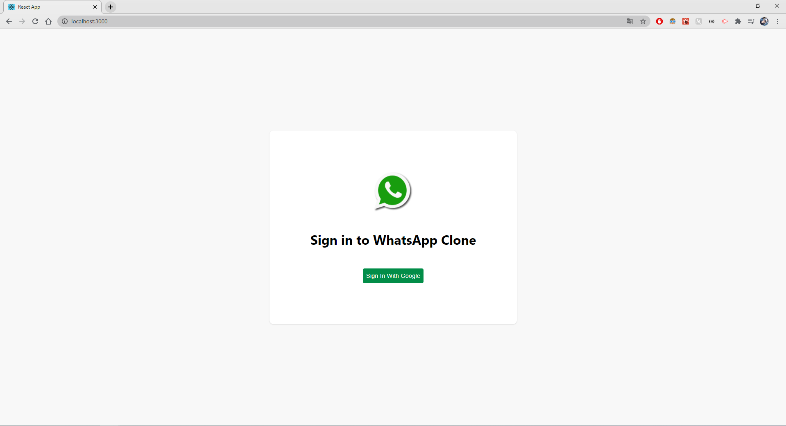
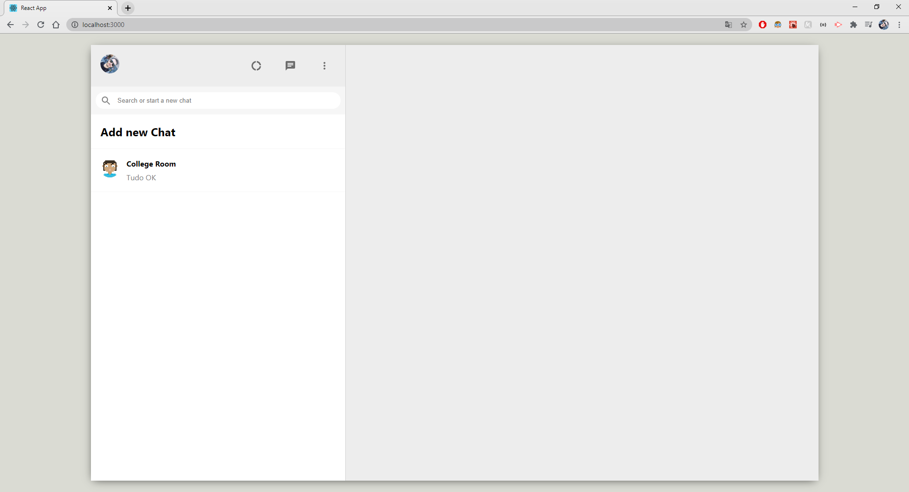
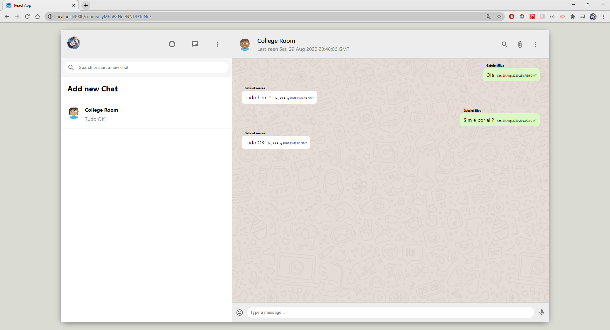
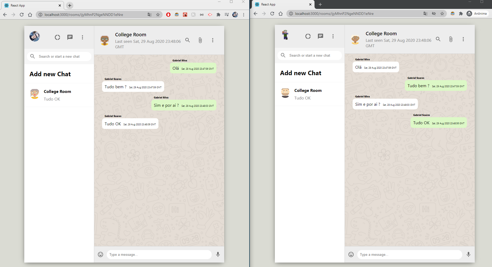

# WhatsApp Clone

Hello guys, this is a project that I did from CleverProgrammers Youtube Channel, you can [click here](https://youtu.be/pUxrDcITyjg?list=PL-J2q3Ga50oMQa1JdSJxYoZELwOJAXExP) to watch it.

Although it's a WhatsApp clone, tha main is a public groups called as "Room" and not a private chat.

This project  use **ReactJS** mainly, I started this project to improve my skills, for that I used the Redux to management the logged user. Besides, was used Firebase as well, for realtime database.

### Features:
- Login with Google
- Create a Room Chat
- Send a message.

### Possible NEW Features:
- Store user' session after Login with Google.
- Create a drop down menu in settings that allows user CHANGE THEME or LOGOUT.
- Delete message by id.

### Clone it & Start the server

`` git clone https://github.com/gabrielgyns/whatsapp-clone.git `` to clone the project

``yarn`` to install dependencies

`` yarn start `` to start server

